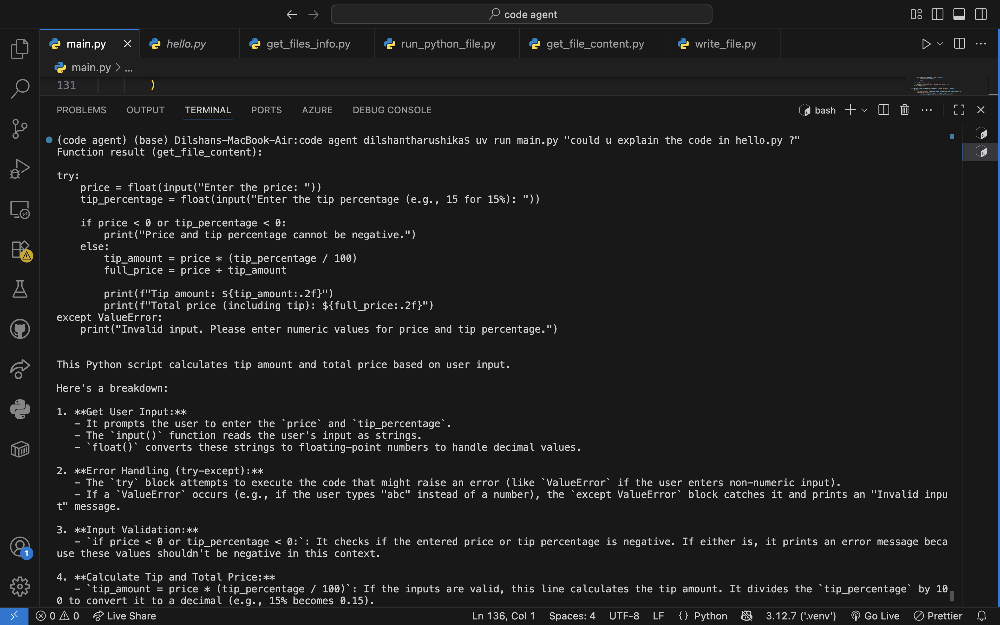
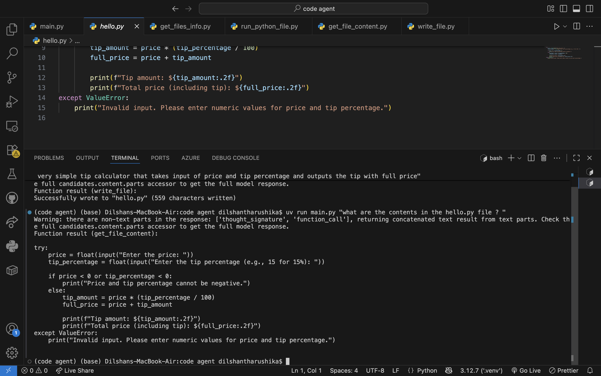
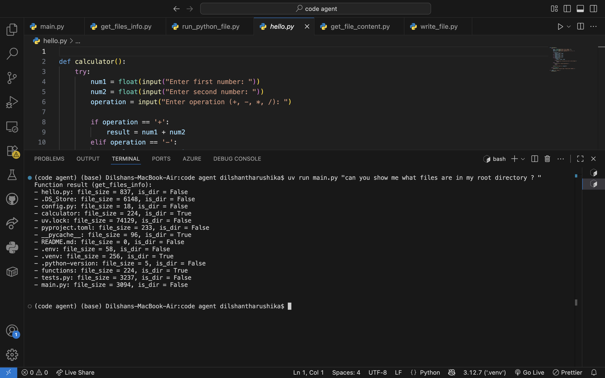
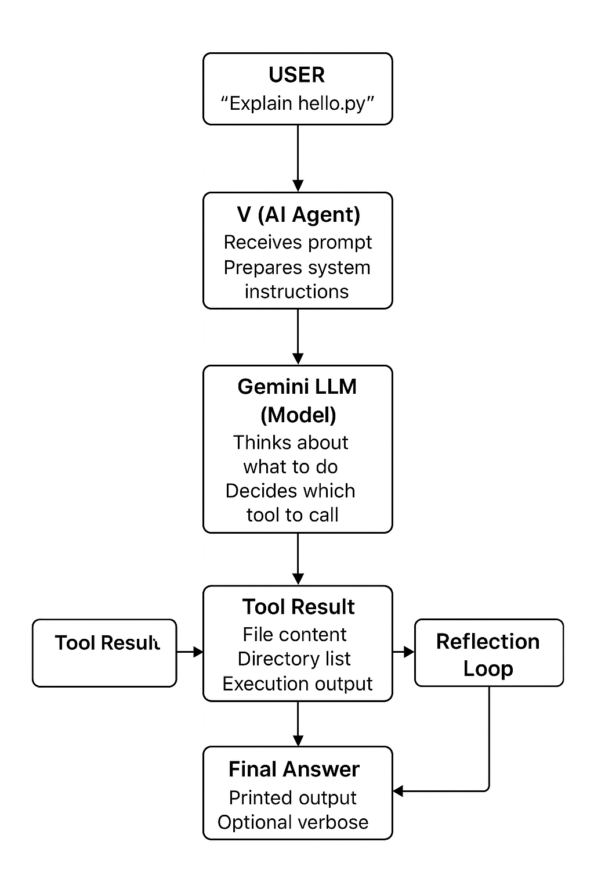

# V – the AI Coding Agent 🤖💻

V is a teaching-first AI coding agent that demonstrates AI agent design patterns in practice.  
It is built on Google Gemini’s function calling capabilities and shows how an LLM can plan, critique, and act through tools instead of just generating text.

[![Watch the demo]]([https://www.linkedin.com/your-post-link](https://www.linkedin.com/posts/tharushika-abedheera-3396311a4_ai-agenticai-geminiapi-activity-7381066444673003520-C_l1?utm_source=share&utm_medium=member_desktop&rcm=ACoAAC_Kg50BnjbR5xO7unO3rKyCnc0-DFK9CqE))

---

## 🧠 AI Agent Design Patterns in V

V is not just a code runner — it follows modern agent design principles:

### 🔧 Tool Use
The agent doesn’t try to “hallucinate” file contents or execution results. Instead, it calls specialized tools (Python functions you provide):

- `get_files_info` – inspect project structure  
- `get_file_content` – read code safely  
- `write_file` – create or edit files  
- `run_python_file` – execute Python scripts  

This makes V grounded and reliable, since it works with the real environment instead of guessing.

### 🪞 Reflection Loop
Instead of answering once and stopping, V follows a multi-step loop (up to 20 iterations):

1. **Think** – The LLM reasons internally about your request.  
2. **Act** – It calls the right tool.  
3. **Observe** – It inspects the tool result.  
4. **Reflect** – It critiques whether the result is enough or needs another step.  
5. **Repeat** – Until a final, high-quality answer is ready.  

This mimics how humans work on coding tasks: explore, test, revise, then explain.

---

## ✨ Features

- 📂 List files and directories  
- 📖 Read file content with safe truncation  
- ✍️ Write or overwrite files  
- ▶️ Run Python files with arguments  
- 🔄 Multi-step reasoning with Reflection Pattern  
- 🛠️ Agentic Tool Use (real functions, not hallucinated code)  

---
 ,  
  ,   

 


## 🛠️ Installation

Clone this repository:

```bash
git clone https://github.com/your-username/v-code-agent.git
cd v-code-agent
Set up environment:
python3 -m venv venv
source venv/bin/activate   # Mac/Linux
venv\Scripts\activate      # Windows
pip install -r requirements.txt
Add your Gemini API key in .env:
GEMINI_API_KEY=your_api_key_here
🚀 Usage
Run V with a natural request:
python main.py "Could you explain the code in hello.py?"
Verbose mode (shows token usage):
python main.py "Run the script in test.py with arg1=hello" --verbose
📂 Project Structure
.
├── main.py                 # Core agent logic + reflection loop
├── functions/
│   ├── get_file_content.py # Tool: read files
│   ├── get_files_info.py   # Tool: list directories
│   ├── run_python_file.py  # Tool: execute code
│   └── write_file.py       # Tool: write files
├── config.py               # Config (e.g. MAX_CHARS)
├── .env                    # Gemini API key
└── requirements.txt        # Dependencies
🧩 Example Interaction
Prompt:
python main.py "Could you explain the code in hello.py?"
Output (simplified):
Function result (get_file_content):
print("Hello, World!")
---

AI Reflection:
This script simply prints 'Hello, World!' to the console when executed.
📌 Why This Matters
V shows how to go beyond a simple chatbot and implement agentic behavior:
Instead of spitting out code, the agent executes real actions.
Instead of answering once, it reflects and iterates until the task is done.
Instead of being rigid, it uses modular tools that can be extended (add your own!).
This makes it a mini framework for experimenting with AI agent design.


